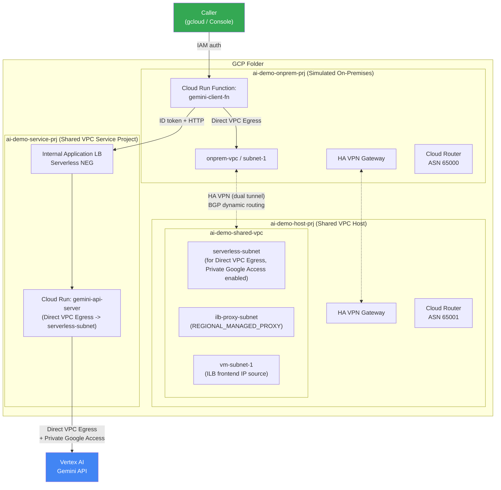

[繁體中文](README.md) | **English**

# Vertex AI Gemini × Shared VPC × HA VPN Hybrid Cloud Demo Architecture

A complete, fully functional GCP demo environment simulating the real-world enterprise scenario of "an on-premises application calling a cloud AI service over a private network VPN" — wired end-to-end from the network layer (Shared VPC, HA VPN + BGP, Internal Application Load Balancer) through the application layer (Cloud Run + Vertex AI Gemini) to the operations layer (Terraform IaC, cost attribution labelling), and **managed entirely with Terraform**.

This is not a toy architecture for tutorial purposes — it is a system that has been genuinely deployed, runs correctly, and has all resources brought into state via `terraform import`.

---

## Architecture Diagram



**Request flow:** Caller (with identity token) → `gemini-client-fn` (simulated on-premises application) → Direct VPC Egress into onprem VPC → HA VPN (dual tunnel + BGP dynamic routing, not static routes) → Shared VPC → Internal Application Load Balancer → `gemini-api-server` → Direct VPC Egress + Private Google Access → Vertex AI Gemini → response returned via the same path, with `name / model / dept / time / input_token / output_token` written as six dimensions to Cloud Logging.

---

## Why It Is Designed This Way

| Component | Purpose | Key Design Decision |
|---|---|---|
| **Shared VPC** (host: `ai-demo-host-prj`, service: `ai-demo-service-prj`) | Separates network resource management from compute resource management, reflecting the common enterprise governance model of "network team owns the network, application team owns the services" | The Internal LB's proxy-only subnet must be created in the host project; the NEG/backend/LB itself is created in the service project and consumes the shared network from the host |
| **HA VPN + Cloud Router (dynamic BGP)** | Simulates private connectivity from on-premises to cloud | Dual tunnels on separate interfaces for high availability; BGP rather than static routes — subnet changes are learnt automatically without manually maintaining routing tables |
| **Internal Application Load Balancer + Serverless NEG** | Allows the VPN peer to call Cloud Run using an internal IP without exposing a public URL | Serverless NEGs can only point to Cloud Run services within the same project, so all LB components are created in the service project — with the exception of the proxy-only subnet, which belongs to the host project by virtue of network ownership |
| **Direct VPC Egress** (used by both Cloud Run services) | Allows Cloud Run to participate in the VPC network directly, without needing a Serverless VPC Access Connector | `gemini-api-server` uses `ALL_TRAFFIC` egress so that Vertex AI traffic also flows through the Shared VPC's `serverless-subnet`, which has **Private Google Access** enabled — keeping all traffic off the public internet |
| **Cloud Run IAM authentication (dual-layer protection)** | `gemini-api-server` is protected by both "network isolation (only accepts traffic from the LB)" and "identity verification (IAM invoker)" | Callers must obtain an identity token whose audience is the **Cloud Run service's native URL** (not the LB's IP) — a common pitfall |
| **Cost attribution labelling** | Vertex AI requests carry four billing labels: `name/model/dept/time`; `input_token/output_token` are only known after the response is received, so they cannot be sent as request-time labels and are instead written to Cloud Logging as a structured log (printing JSON to stdout, which Cloud Run automatically parses into `jsonPayload`) | Demonstrates the commonly overlooked constraint that "billing labels can only carry values known at request time", and shows how structured logs can supplement data that is only available afterwards |
| **Terraform, all resources imported into state** | The entire environment was originally built manually with `gcloud` and only later converted to IaC | Demonstrates the real-world approach for "brownfield environments adopting IaC": write config to match the current state → `terraform import` each resource → iterate `terraform plan` until zero drift — rather than tearing down and rebuilding from scratch |
| **Cloud Run image built with `null_resource` + Cloud Build buildpacks** | The Terraform Google provider has no resource for "build from source" | Uses the source directory hash as the image tag — if the source hasn't changed, no rebuild is triggered; if the code or the build script itself changes, re-applying will trigger a rebuild |

---

## Usage

### Prerequisites

- A GCP Organisation and an account with permission to create folders/projects
- A linked Billing Account
- `gcloud`, `terraform` >= 1.5, logged in via both `gcloud auth login` **and** `gcloud auth application-default login` (the two credential sets are managed separately — Terraform provider uses ADC)
- This repo uses `asia-east1` throughout; model IDs (e.g. `gemini-3.6-flash`) are illustrative — adjust to whichever models are actually available to you

### Deployment (building from scratch in a new environment)

```bash
cd terraform
cp terraform.tfvars.example terraform.tfvars
# Edit terraform.tfvars: fill in billing_account and the two VPN pre-shared keys (generate your own; both sides must match)

terraform init
terraform apply
```

`apply` creates resources in order: folder → 3 projects → Shared VPC network → HA VPN + BGP → two Cloud Runs (triggering real Cloud Build builds from `api-server/` and `client-function/`) → Internal LB → cross-project IAM. A first-time full build takes approximately 10–15 minutes (VPN tunnel establishment + BGP convergence add extra wait time).

### Calling the Service for Testing

`gemini-client-fn` is **not publicly accessible** by default and requires IAM authentication. The recommended approach for testing is the Cloud Run built-in local authentication proxy — no need to handle identity tokens yourself:

```bash
gcloud run services proxy gemini-client-fn \
  --project=<your-onprem-project-id> --region=asia-east1 --port=18080

# Open another terminal
curl -X POST http://127.0.0.1:18080/ \
  -H "Content-Type: application/json" \
  -d '{"name":"your-name","model":"Gemini 3.5 Flash","prompt":"Hello"}'
```

### Redeploying After Code Changes

After editing `api-server/main.py` or `client-function/main.py`, simply run `terraform apply` — the source hash changes, causing the `null_resource` to automatically trigger a rebuild and deploy the new revision.

---

## Notes

- **This is a demo/learning architecture, not a production-ready configuration.** Before using it in production, at a minimum you would need to:
  - Switch the Terraform state to an **encrypted remote backend** (e.g. GCS + CMEK) — the current local state **stores VPN pre-shared keys in plaintext** and must never be committed to version control (already excluded via `.gitignore`, but you are responsible for keeping the local state file secure)
  - The Internal LB is currently HTTP (port 80) with no TLS, which is acceptable for an all-internal + VPN environment, but HTTPS is recommended for production
  - There is no rate limiting on `gemini-client-fn` — it triggers billable Gemini API calls directly. Assess abuse and overspend risk carefully before exposing it (which is also why the example deliberately keeps it "requires authentication, not public")
  - `gemini-3.6-flash` / `gemini-3.1-pro-preview` are illustrative model IDs — refer to the currently available Vertex AI models
- **Resources that incur ongoing charges**: HA VPN Gateways (one on each side, billed hourly), Internal Load Balancer (billed hourly + per traffic), Cloud Run (billed per request; idle with min-instance=0 incurs no charge). Remember to run `terraform destroy` when not in use.
- The default compute service account used by Cloud Build **does not automatically receive the Editor role** under some org policy configurations. `iam_support.tf` adds `storage.objectViewer` / `cloudbuild.builds.builder` — this is a real pitfall that was encountered, not a redundant addition.

---

## What You Can Learn from This Project

### For Individuals (practising GCP networking / hybrid cloud skills)

- **Real constraints of Shared VPC**: which resources must be in the host project vs. which can be in the service project (especially the easily-missed constraint that Serverless NEGs can only point to Cloud Run services in the same project)
- **Complete HA VPN + Cloud Router BGP build details**, including the two most commonly misconfigured items: IKE pre-shared keys must be identical on both sides; BGP link-local IPs must fall within the same `/30` block
- **Direct VPC Egress vs. Serverless VPC Access Connector** — the difference, and how Private Google Access keeps Vertex AI calls entirely off the public internet
- **Full wiring for Cloud Run with an Internal Application LB** (proxy-only subnet, Serverless NEG, permission design across network tiers)
- The complete real-world workflow for **importing an existing manually-built environment into IaC using `terraform import`**, including dealing with "fields that GCP APIs do not return" (such as VPN keys) — a known pain point in import

### For Enterprises (evaluating AI workload landing architecture)

- A directly referenceable **reference architecture for "on-premises applications calling a cloud LLM over a private network"** — no need to expose AI services to the public internet
- **Network isolation pattern for AI services**: using Shared VPC to separate "AI compute" and "network governance" responsibilities, consistent with the cloud governance structure of most enterprises
- **Cost attribution (chargeback) for LLM API calls**: dual-track billing labels + structured logs, allowing finance teams and PMs to split actual spend by `dept` and `model`, while retaining per-request token counts for usage analysis
- **An incremental path for brownfield environments adopting Terraform**: not every enterprise can start from scratch with IaC. This repo fully demonstrates "get the existing environment working first, then progressively bring it under Terraform management" rather than requiring a complete teardown and rebuild

---

## Repo Structure

```
.
├── api-server/              # Cloud Run: receives internal requests, calls Vertex AI Gemini
├── client-function/         # Cloud Run Function: simulated on-premises application entry point
└── terraform/               # IaC for the entire environment (folder/project/network/VPN/LB/Cloud Run/IAM)
```
