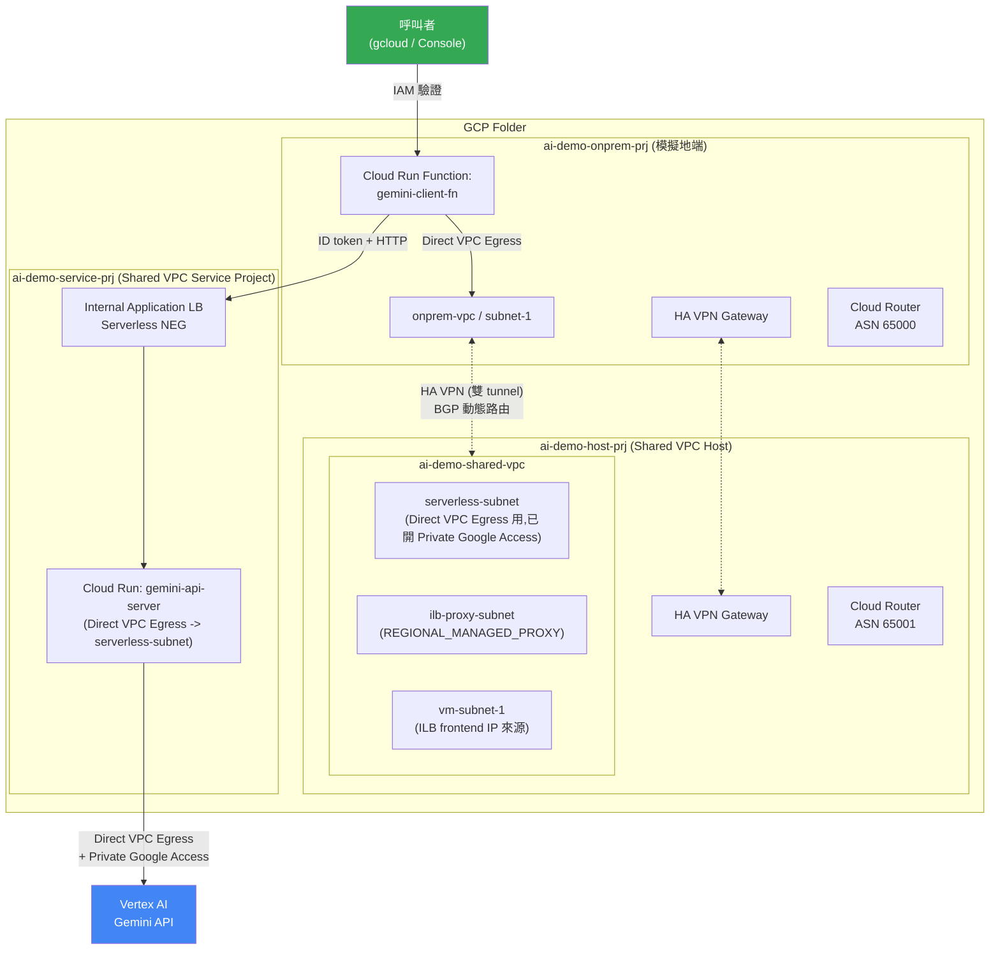

# Vertex AI Gemini × Shared VPC × HA VPN 混合雲示範架構

一個完整、可實際運作的 GCP 示範環境:模擬「地端(on-prem)應用透過 VPN 私網呼叫雲端 AI 服務」的真實企業場景 —— 從網路層(Shared VPC、HA VPN + BGP、Internal Application Load Balancer)到應用層(Cloud Run + Vertex AI Gemini),再到維運層(Terraform IaC、成本歸屬 labeling),完整串起來並且**全部用 Terraform 管理**。

這不是教學用的玩具架構,是真的部署起來、跑得動、資源都用 `terraform import` 帶進 state 的一套系統。

---

## 架構圖



**請求流程:** 呼叫者(帶身份驗證)→ `gemini-client-fn`(模擬地端應用)→ Direct VPC Egress 進 onprem VPC → HA VPN(雙 tunnel + BGP 動態路由,不是靜態路由)→ Shared VPC → Internal Application Load Balancer → `gemini-api-server` → Direct VPC Egress + Private Google Access → Vertex AI Gemini → 回應原路送回,並把 `name / model / dept / time / input_token / output_token` 六個維度寫進 Cloud Logging。

---

## 為什麼這樣設計

| 元件 | 用途 | 關鍵設計決策 |
|---|---|---|
| **Shared VPC**(host: `ai-demo-host-prj`,service: `ai-demo-service-prj`) | 網路資源與運算資源分離管理,符合企業常見的「網路團隊管網路、應用團隊管服務」治理模式 | Internal LB 的 proxy-only subnet 必須建在 host project;NEG/backend/LB 本身建在 service project,直接消費 host 的共享網路 |
| **HA VPN + Cloud Router(動態 BGP)** | 模擬地端到雲端的私網連線 | 雙 tunnel 走不同介面做高可用;BGP 而非靜態路由,子網路變動時路由自動學習,不用手動維護路由表 |
| **Internal Application Load Balancer + Serverless NEG** | 讓 VPN 對端可以用內部 IP 呼叫 Cloud Run,不曝露公開網址 | Serverless NEG 只能指向同專案的 Cloud Run service,所以 LB 全套元件都建在 service project,只有 proxy-only subnet 例外(網路擁有權在 host) |
| **Direct VPC Egress**(兩個 Cloud Run 都用) | 讓 Cloud Run 直接участ VPC 網路,不需要 Serverless VPC Access Connector 這個額外資源 | `gemini-api-server` 用 `ALL_TRAFFIC` egress,讓呼叫 Vertex AI 的流量也走 Shared VPC 的 `serverless-subnet`,搭配該子網已開的 **Private Google Access**,全程不經公開網際網路 |
| **Cloud Run IAM 驗證(雙層防護)** | `gemini-api-server` 同時有「網路隔離(只接受 LB 來源)」+「身份驗證(IAM invoker)」兩層 | 呼叫方必須拿到 audience 對到 **Cloud Run service 原生 URL**(不是 LB 的 IP)的 identity token,這是常見的踩坑點 |
| **成本歸屬 labeling** | Vertex AI 請求帶 `name/model/dept/time` 四個 billing labels;`input_token/output_token` 因為要等回應才知道,無法在請求當下當作 label,改寫成 Cloud Logging structured log(印 JSON 到 stdout,Cloud Run 自動解析成 `jsonPayload`) | 示範「billing label 只能帶請求當下已知的值」這個常被忽略的限制,以及用結構化 log 補足事後才知道的資料 |
| **Terraform,resource 全部 import 進 state** | 整個環境原本是用 `gcloud` 手動建的,事後才轉成 IaC | 示範「棕地(brownfield)環境導入 IaC」的實際做法:先寫 config 對齊現況、`terraform import` 逐一帶入、`terraform plan` 反覆修到零差異,而不是砍掉重練 |
| **Cloud Run image 用 `null_resource` + Cloud Build buildpacks build** | Terraform 的 Google provider 沒有「從原始碼 build」這種資源 | 用原始碼資料夾的 hash 當 image tag,原始碼沒變就不重新 build;程式碼改了、或建置腳本本身要修正時,重新 apply 就會觸發 rebuild |

---

## 使用方式

### 前置需求

- GCP Organization,一個你有權限建立 folder/project 的帳號
- 已連結的 Billing Account
- `gcloud`、`terraform` >= 1.5、已登入 `gcloud auth login` **和** `gcloud auth application-default login`(兩組憑證分開管理,Terraform provider 走 ADC)
- 這個 repo 用的 region 統一是 `asia-east1`,模型 ID(`gemini-3.6-flash` 等)是範例用途,請依實際可用模型調整

### 部署(在全新環境從零建立)

```bash
cd terraform
cp terraform.tfvars.example terraform.tfvars
# 編輯 terraform.tfvars:填入 billing_account,以及兩把 VPN pre-shared key(自己產生,兩邊要一致)

terraform init
terraform apply
```

`apply` 會依序建立 folder → 3 個 project → Shared VPC 網路 → HA VPN + BGP → 兩個 Cloud Run(過程中真的觸發 Cloud Build 從 `api-server/`、`client-function/` build image)→ Internal LB → 跨專案 IAM。第一次全新建置大約需要 10–15 分鐘(VPN 隧道 + BGP 收斂需要額外等待)。

### 呼叫測試

`gemini-client-fn` 預設**不公開**、需要 IAM 驗證,建議用 Cloud Run 內建的本機認證 proxy 測試,不用自己處理 identity token:

```bash
gcloud run services proxy gemini-client-fn \
  --project=<your-onprem-project-id> --region=asia-east1 --port=18080

# 另開一個終端機
curl -X POST http://127.0.0.1:18080/ \
  -H "Content-Type: application/json" \
  -d '{"name":"your-name","model":"Gemini 3.5 Flash","prompt":"你好"}'
```

### 修改程式碼後重新部署

改 `api-server/main.py` 或 `client-function/main.py` 後,直接 `terraform apply` ——原始碼 hash 會變,`null_resource` 自動觸發重新 build + 部署新 revision。

---

## 注意事項

- **這是示範/教學用途的架構,不是直接可上生產的設定**。真的要用在生產環境前至少要補:
  - Terraform state 改用 **加密的 remote backend**(例如 GCS + CMEK),目前用的 local state **明文存著 VPN pre-shared key**,不能提交到版本控制(已用 `.gitignore` 排除,但你本機的 state 檔本身要自己保管好)
  - Internal LB 目前是 HTTP(port 80)沒有 TLS,純粹因為全程走內網 + VPN,正式環境建議還是走 HTTPS
  - 沒有對 `gemini-client-fn` 做請求頻率限制,它會直接觸發計費的 Gemini API 呼叫,曝露出去前務必評估濫用/超支風險(這也是為什麼範例裡刻意讓它保持「需要驗證、不公開」)
  - `gemini-3.6-flash` / `gemini-3.1-pro-preview` 這些 model ID 是範例,請自行對照 Vertex AI 當下實際可用的模型
- **會持續計費的資源**:HA VPN Gateway(兩邊各一個,依小時計費)、Internal Load Balancer(依小時 + 流量計費)、Cloud Run(有請求才計費,但 min-instance=0 情況下閒置不收費)。不用的時候記得 `terraform destroy`。
- Cloud Build 用的 default compute service account 在某些 org policy 設定下**不會自動取得 Editor 角色**,`iam_support.tf` 裡補了 `storage.objectViewer` / `cloudbuild.builds.builder`,這是真實踩過的坑,不是多餘設定。

---

## 這個專案可以學到什麼

### 對個人(想練 GCP 網路/混合雲技能)

- **Shared VPC 的實際限制**:哪些資源必須建在 host project、哪些可以建在 service project(尤其是 Serverless NEG 只能指向同專案 Cloud Run 這個容易踩雷的限制)
- **HA VPN + Cloud Router BGP** 的完整建置細節,包括最容易搞錯的兩件事:IKE pre-shared key 兩端要完全一致、BGP link-local IP 要落在同一個 /30 網段
- **Direct VPC Egress vs. Serverless VPC Access Connector** 的差異,以及 Private Google Access 如何讓「呼叫 Google API」全程走內網
- **Cloud Run 搭配 Internal Application LB** 的完整佈線(proxy-only subnet、Serverless NEG、跨網路層級的權限設計)
- 用 `terraform import` **把既有手動建置的環境轉成 IaC** 的完整實戰流程,包含處理「GCP API 不會回傳的欄位(如 VPN 密鑰)」這種 import 的已知痛點

### 對企業(評估 AI workload 落地架構)

- 一個可以直接參考的**「地端應用私網呼叫雲端 LLM」參考架構**,不需要把 AI 服務暴露在公開網際網路上
- **AI 服務的網路隔離模式**:用 Shared VPC 把「AI 運算」和「網路治理」的責任分開,符合多數企業的雲端治理組織架構
- **LLM API 呼叫的成本歸屬(chargeback)做法**:billing label + 結構化 log 雙軌並行,讓財務/PM 可以照 `dept`、`model` 拆分實際花費,也保留每一筆請求的 token 用量方便做用量分析
- **棕地環境導入 Terraform 的漸進式路徑**:不是所有企業都能從零開始用 IaC,這個 repo 完整示範「先讓現有環境動起來、再逐步把它收進 Terraform 管理」的實際做法,而不是要求全部砍掉重練

---

## Repo 結構

```
.
├── api-server/              # Cloud Run: 接收內部請求、呼叫 Vertex AI Gemini
├── client-function/         # Cloud Run Function: 模擬地端應用的呼叫入口
└── terraform/                # 整套環境的 IaC(folder/project/網路/VPN/LB/Cloud Run/IAM)
```
